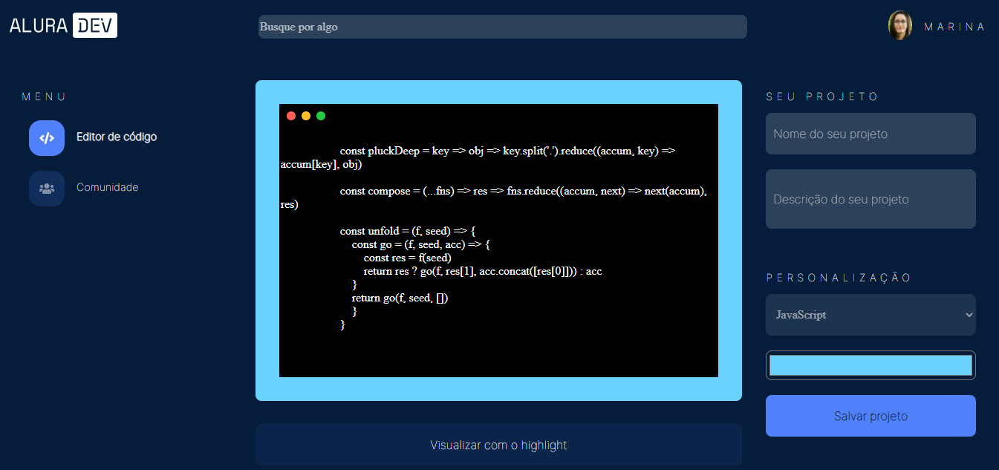
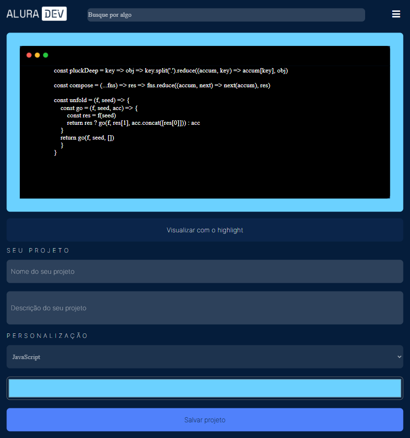
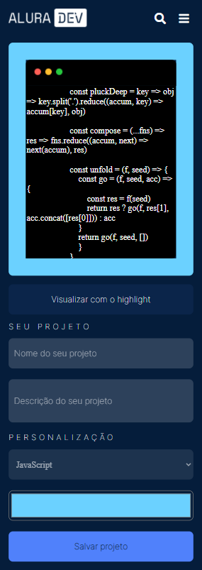
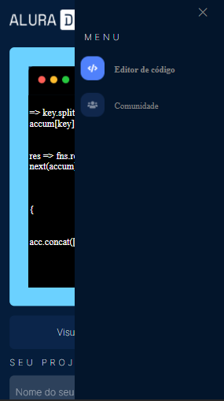
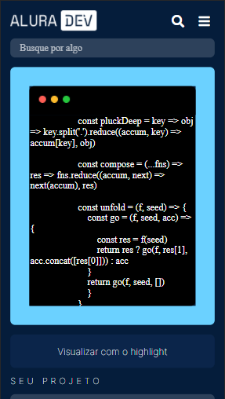

<h1 style="text-align: center"> Desafio Alura - Semana 1</h1>
<h2>Serão 4 semanas para você implementar um sistema com HTML, CSS, JavaScript e até frameworks SPA, do básico ao avançado.</h2>
<h3 style="color:red">Semana 1</h3>
 
Desenvolvimento de um design responsivo com base à um modelo disponível no Figma.

* Versão Desktop:

* Versão Tablet:

* Versão Mobile:

  

* Menu e Search da versão mobile

 

